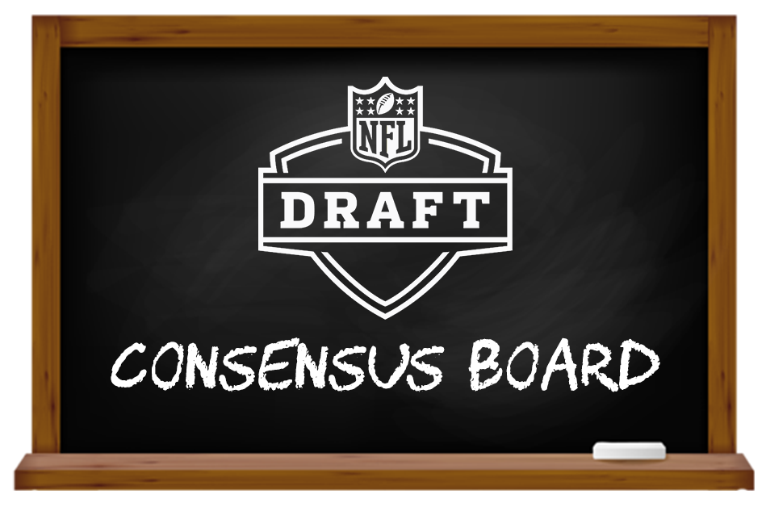

## Jack Lichtenstein

- I graduated Magna Cum Laude with a 3.969 GPA (nice) from Duke University in the class of 2022
- I was a data and scouting analyst for the Duke Men's Basketball Team
- I was a co-founder of the [Duke Sports Analytics Club](http://www.dukesportsanalytics.com/home)

### Check out some of my projects in R and RShiny

- [2023 NCAA March Madness Machine Learning Mania 7th place winner](https://www.kaggle.com/competitions/march-machine-learning-mania-2023/discussion/400116)
- [2022 NFL Big Data Bowl college winner](https://operations.nfl.com/updates/football-ops/nfl-announces-finalists-for-fourth-annual-nfl-big-data-bowl/)
- 2016-Present [Consensus Draft Boards](https://jacklich10.com/bigboard/)
  - [NFL Draft](https://jacklich10.com/bigboard/nfl/)
  - [NBA Draft](https://jacklich10.com/bigboard/nba/)
- Syracuse Football Analytics Blitz 2021 [runner-up](https://github.com/JackLich10/JackLich10/blob/main/syracuse_football_analytics_blitz/Syracuse%20Football%20Analtyics.pdf)/Room 4 winner
  - Determining optimal run/pass ratios in the NFL
- Articles on Open Source Football
  - Altering expected points added (EPA) for opponent while using [dynamic rolling windows](https://www.opensourcefootball.com/posts/2020-12-29-exploring-rolling-averages-of-epa/)
  - Exploring stability and predictive power of [penalty rates](https://www.opensourcefootball.com/posts/2021-01-21-exploring-stability-and-predictive-power-of-penalties-in-the-nfl/)
- College basketball [shiny application](https://jacklich10.shinyapps.io/Duke_Basketball/)
  - Display team or player [shot charts](https://github.com/JackLich10/JackLich10/blob/main/DukeZionWilliamsonShotChart201819.pdf) by game
- Duke 2020 DataFest competition [winner for best visualizations](https://www2.stat.duke.edu/datafest-covid19/projects/AmericasNextTopModellers_slides.pdf)
- College basketball [tracking data](https://bigdata.duke.edu/sites/bigdata.duke.edu/files/site-images/Team22bExecSumm.pdf)
  - Expected FG% based on shot distance, defender locations, time on shot clock, etc.
  - Quantifying off-ball player "gravity" using barycentric coordinates
- Predicting [baseball performance](https://bigdata.duke.edu/sites/bigdata.duke.edu/files/site-images/Poster%20Presentation%20Team%2018.pdf) from vision and athletic assessments
- Basic tutorials and walkthroughs for the Duke Sports Analytics Club
  - An [initial exploration](http://www.dukesportsanalytics.com/tutorial_post) of publicly available college basketball data
  - [Getting started](https://github.com/Duke-Sports-Analytics-Club/sports-analytics-walkthrough) with common sports data sources like `nflfastR` and `kenpomR` as well as basic web-scraping

### Check out some of my packages and data sources

- `gamezoneR` is an [R package](https://jacklich10.github.io/gamezoneR/index.html) for working with NCAA Men's Basketball play-by-play data from STATS LLC's GameZone. The package allows users to scrape team and master schedules as well as play-by-play data with shot locations into a tidy format. The main benefit of gamezoneR is the volume of shot location data available (typically 170,000+ in a season) 
- [NFL draft prospect data](https://www.kaggle.com/jacklichtenstein/espn-nfl-draft-prospect-data) from ESPN dating back to 1967
  - Text analysis for over 4,000 prospects
  - ESPN draft prospect grades and positional ranks

   

### Connect with me:

[][twitter]
[][linkedin]
[][instagram]
[][youtube]

 

### Languages and Tools:

 
 

[twitter]: https://twitter.com/jacklich10
[youtube]: https://youtube.com/channel/UCi8Xt7Iz9gSjzpA2orPBRYA
[instagram]: https://instagram.com/jack_lich/
[linkedin]: https://linkedin.com/in/jack-lichtenstein-55756a155/

